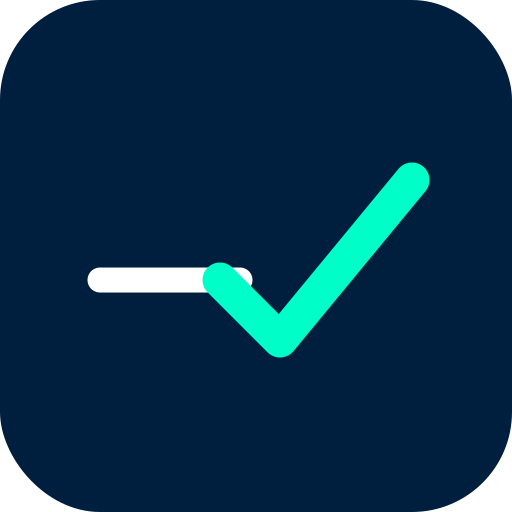

<<<<<<< HEAD
# Sellik — Cash Register & Reconciliation App

<p align="center">
  
</p>

<p align="center">
  
  
  
  
  
  
</p>

---

## 📋 Description

**Sellik** is a cross-platform mobile and desktop application built with **.NET MAUI** that helps businesses keep precise control of their cash register. It includes denomination-based counting, cash movement tracking, OCR-powered voucher scanning, report exporting, and historical statistics.

---

## ✨ Features

- 💵 **Cash reconciliation** — Count bills and coins by denomination with automatic total calculation.
- 📋 **Cash movements** — Record income and expenses with customizable concepts.
- 🧾 **OCR voucher scanning** — Automatic ticket data capture using native OCR and cloud OCR (GPT-4o Vision / Google Vision).
- 📊 **Statistics & history** — Trend visualization and historical record browsing.
- 📝 **Notes** — Built-in notepad for quick annotations during a shift.
- 🗂️ **Cash sessions** — Manage shift openings and closings.
- 📤 **Export** — Generate reports in Excel (.xlsx) and PDF.
- 🌙 **Light / dark theme** — Full dynamic theme support.
- 🌐 **Multi-language** — Localization support (Spanish / English).
- ⚙️ **Flexible configuration** — Customizable denominations and app settings.

---

## 🏗️ Architecture

The project follows the **MVVM** (Model-View-ViewModel) pattern:

```
CajaApp/
├── Models/               # Data entities (SQLite)
├── ViewModels/           # Presentation logic (MVVM)
├── Views/                # XAML pages
├── Services/             # Business logic and data access
├── Helpers/              # XAML extensions (localization, etc.)
├── Converters/           # Value converters for bindings
├── Resources/
│   ├── Strings/          # .resx localization files
│   ├── Styles/           # Global themes and styles
│   ├── Fonts/            # OpenSans
│   └── AppIcon/
└── Platforms/            # Platform-specific code
    ├── Android/
    ├── iOS/
    ├── MacCatalyst/
    └── Windows/
```

---

## 🛠️ Technologies & dependencies

| Technology | Purpose |
|---|---|
| [.NET 9 + .NET MAUI](https://learn.microsoft.com/dotnet/maui) | Cross-platform framework |
| [SQLite-net-pcl](https://github.com/praeclarum/sqlite-net) | Local database |
| [CommunityToolkit.Maui](https://github.com/CommunityToolkit/Maui) | MAUI controls and utilities |
| [Plugin.Maui.OCR](https://github.com/kfrancis/ocr) | Native optical character recognition |
| [ClosedXML](https://github.com/ClosedXML/ClosedXML) | Excel file generation |
| [QuestPDF](https://www.questpdf.com/) | PDF generation (Windows / iOS / Mac) |
| [SkiaSharp](https://github.com/mono/SkiaSharp) | Graphics rendering on Android |
| OpenAI GPT-4o Vision / Google Vision | Cloud OCR for vouchers |

---

## 📱 Supported platforms

| Platform | Minimum version |
|---|---|
| Android | API 21 (Android 5.0) |
| iOS | 11.0 |
| macOS (Mac Catalyst) | 13.1 |
| Windows | 10 (build 17763) |

---

## 🚀 Getting started

### Prerequisites

- [Visual Studio 2022+](https://visualstudio.microsoft.com/) with the **.NET MAUI** workload
- .NET 9 SDK
- Android SDK (for Android builds) or Xcode (for iOS/Mac builds)

### Clone and open

```bash
git clone <repository-url>
cd CajaApp
```

Open `CajaApp.sln` in Visual Studio — NuGet packages will be restored automatically.

### Configure secrets (Cloud OCR)

To use the cloud OCR engine, set your API keys in `Services/AppSecrets.cs`:

```csharp
public static class AppSecrets
{
    public const string OpenAIApiKey    = "sk-...";
    public const string GoogleVisionKey = "...";
}
```

> ⚠️ **Do not commit your keys to the repository.** Use environment variables or a secrets manager in production.

### Run

Select the target platform in Visual Studio and press **F5**, or use:

```bash
dotnet build -f net9.0-android
dotnet build -f net9.0-windows10.0.19041.0
```

---

## 📦 Production build (Android)

```bash
dotnet publish -f net9.0-android -c Release
```

Release optimizations include: **R8** minification, **SdkOnly** linker, selective **AOT**, partial **.NET trim**, and `arm64`-only APK.

---

## 📁 Database

Local **SQLite** stored in `FileSystem.AppDataDirectory`. Tables created automatically on first launch:

`Sesion` · `CajaRegistro` · `MovimientoEfectivo` · `ConceptoMovimiento` · `Voucher` · `ConfiguracionApp` · `DenominacionConfig` · `Notas`

---

## 🌐 Localization

- `Resources/Strings/AppResources.resx` — Spanish (default)
- `Resources/Strings/AppResources.en.resx` — English

Language applied at startup via `LocalizationService`.

---

## 📄 License

© QuBitSoft — Yoansy L.T · All rights reserved.

---

## 📬 Contact

**QuBitSoft** · ✉️ [qubitsoftxxi@gmail.com](mailto:qubitsoftxxi@gmail.com)

---
---

## 📋 Descripción

**Sellik** es una aplicación móvil y de escritorio desarrollada con **.NET MAUI** que permite a negocios y comercios llevar un control preciso de su caja en efectivo. Incluye registro por denominaciones, gestión de movimientos, escaneo de vouchers mediante OCR, exportación de reportes y estadísticas históricas.

---

## ✨ Características principales

- 💵 **Arqueo de caja** — Conteo de billetes y monedas por denominación con cálculo automático del total.
- 📋 **Movimientos de efectivo** — Registro de entradas y salidas con conceptos personalizables.
- 🧾 **Escaneo de vouchers con OCR** — Captura automática de datos de tickets mediante OCR nativo y OCR en la nube (GPT-4o Vision / Google Vision).
- 📊 **Estadísticas e historial** — Visualización de tendencias y consulta de registros anteriores.
- 📝 **Notas** — Bloc de notas integrado para anotaciones rápidas durante el turno.
- 🗂️ **Sesiones de caja** — Gestión de aperturas y cierres de turno.
- 📤 **Exportación** — Generación de reportes en Excel (.xlsx) y PDF.
- 🌙 **Tema claro / oscuro** — Soporte completo de temas dinámicos.
- 🌐 **Multiidioma** — Soporte de localización (Español / Inglés).
- ⚙️ **Configuración flexible** — Denominaciones personalizables y ajustes de la aplicación.

---

## 🏗️ Arquitectura

El proyecto sigue el patrón **MVVM** (Model-View-ViewModel):

```
CajaApp/
├── Models/               # Entidades de datos (SQLite)
├── ViewModels/           # Lógica de presentación (MVVM)
├── Views/                # Páginas XAML
├── Services/             # Lógica de negocio y acceso a datos
├── Helpers/              # Extensiones XAML (localización, etc.)
├── Converters/           # Convertidores de valores para bindings
├── Resources/
│   ├── Strings/          # Archivos .resx de localización
│   ├── Styles/           # Temas y estilos globales
│   ├── Fonts/            # OpenSans
│   └── AppIcon/
└── Platforms/            # Código específico por plataforma
    ├── Android/
    ├── iOS/
    ├── MacCatalyst/
    └── Windows/
```

---

## 🛠️ Tecnologías y dependencias

| Tecnología | Uso |
|---|---|
| [.NET 9 + .NET MAUI](https://learn.microsoft.com/dotnet/maui) | Framework multiplataforma |
| [SQLite-net-pcl](https://github.com/praeclarum/sqlite-net) | Base de datos local |
| [CommunityToolkit.Maui](https://github.com/CommunityToolkit/Maui) | Controles y utilidades MAUI |
| [Plugin.Maui.OCR](https://github.com/kfrancis/ocr) | Reconocimiento óptico de caracteres nativo |
| [ClosedXML](https://github.com/ClosedXML/ClosedXML) | Generación de archivos Excel |
| [QuestPDF](https://www.questpdf.com/) | Generación de PDF (Windows / iOS / Mac) |
| [SkiaSharp](https://github.com/mono/SkiaSharp) | Renderizado gráfico en Android |
| OpenAI GPT-4o Vision / Google Vision | OCR en la nube para vouchers |

---

## 📱 Plataformas soportadas

| Plataforma | Versión mínima |
|---|---|
| Android | API 21 (Android 5.0) |
| iOS | 11.0 |
| macOS (Mac Catalyst) | 13.1 |
| Windows | 10 (build 17763) |

---

## 🚀 Primeros pasos

### Requisitos previos

- [Visual Studio 2022+](https://visualstudio.microsoft.com/) con la carga de trabajo **.NET MAUI**
- .NET 9 SDK
- Android SDK (para build Android) o Xcode (para build iOS/Mac)

### Clonar y abrir

```bash
git clone <url-del-repositorio>
cd CajaApp
```

Abre `CajaApp.sln` en Visual Studio y restaura los paquetes NuGet automáticamente.

### Configurar secrets (OCR en la nube)

```csharp
public static class AppSecrets
{
    public const string OpenAIApiKey    = "sk-...";
    public const string GoogleVisionKey = "...";
}
```

> ⚠️ **No subas tus claves al repositorio.** Utiliza variables de entorno o un gestor de secretos en producción.

### Ejecutar

```bash
dotnet build -f net9.0-android
dotnet build -f net9.0-windows10.0.19041.0
```

---

## 📦 Build de producción (Android)

```bash
dotnet publish -f net9.0-android -c Release
```

Optimizaciones incluidas: **R8**, linker **SdkOnly**, **AOT** selectivo, **trim** parcial de ensamblados y APK solo para `arm64`.

---

## 📁 Base de datos

**SQLite** local en `FileSystem.AppDataDirectory`. Las tablas se crean automáticamente al iniciar:

`Sesion` · `CajaRegistro` · `MovimientoEfectivo` · `ConceptoMovimiento` · `Voucher` · `ConfiguracionApp` · `DenominacionConfig` · `Notas`

---

## 🌐 Localización

- `Resources/Strings/AppResources.resx` — Español (predeterminado)
- `Resources/Strings/AppResources.en.resx` — Inglés

Idioma aplicado al iniciar mediante `LocalizationService`.

---

## 📄 Licencia

© QuBitSoft — Yoansy L.T · Todos los derechos reservados.

---

## 📬 Contacto

**QuBitSoft** · ✉️ [qubitsoftxxi@gmail.com](mailto:qubitsoftxxi@gmail.com)
=======
# Sellik
Comprehensive Cash Register Reconciliation System => Sistema Integral para Arqueo de Caja Contable
>>>>>>> 22cfaff23547f273aae98ae0a9dfcbe42c6b53ec
# Sellik

